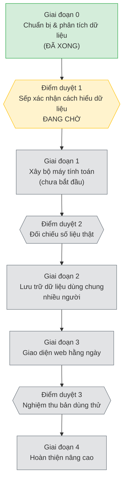

# LỘ TRÌNH DỰ ÁN — BẢN DỄ HIỂU

> File này viết cho người **không rành kỹ thuật/lập trình** — chủ dự án,
> quản lý, hoặc bất kỳ ai muốn biết dự án đang tới đâu mà không cần đọc
> thuật ngữ code.
>
> Bản đầy đủ, chi tiết kỹ thuật (dành cho người trực tiếp code): xem
> `PROJECT/PROJECT_PROGRESS.md`. File này là bản dịch dễ hiểu của cùng một
> lộ trình — **không phải một lộ trình khác**. Khi bản kỹ thuật thay đổi,
> file này phải được cập nhật theo (xem "Ghi chú" ở cuối).
>
> Bản sơ đồ trực quan (không cần đọc bảng, chỉ cần nhìn): xuất bản lúc
> 2026-08-23 tại https://claude.ai/code/artifact/a1352611-9616-4f66-9572-376eedc99e7a
> — link riêng tư, chỉ người được chia sẻ mới xem được. Đây là ảnh chụp tại
> một thời điểm, không tự cập nhật theo file này; tạo lại khi cần bản mới.
>
> Cập nhật lần cuối: 2026-08-23.

## Dự án này làm gì, tóm tắt 1 câu

Xây một công cụ tự động tạo ra **Báo cáo Kinh doanh** hằng tháng cho công
ty, thay thế việc nhân viên phải tự tay ráp file Excel mỗi tháng — nhập
số liệu bán hàng thô, tự tính hoa hồng/lợi nhuận, tự lên báo cáo.

## Đang tới đâu rồi (tóm tắt nhanh)

- **Đã xong 4/31 bước** (giai đoạn chuẩn bị & phân tích).
- **Đang dừng lại chờ một việc duy nhất:** chủ dự án đọc và xác nhận phần
  phân tích dữ liệu là đúng ("Điểm duyệt 1" bên dưới). Việc này **không
  cần biết kỹ thuật** — chỉ cần đọc và nói "đúng" hoặc "sai chỗ này".
- Sau khi duyệt, các bước tiếp theo mới được phép bắt đầu.

## Cách đọc file này

Mỗi dòng là một công đoạn công việc, theo đúng thứ tự phải làm (bước sau
luôn cần bước trước làm xong, trừ khi ghi rõ "làm song song được").

Trạng thái: ✅ Đã xong · 🚦 Đang chờ duyệt · ⬜ Chưa bắt đầu

**"Mức xử lý"** cho biết việc đó cần loại năng lực nào để làm — không ảnh
hưởng tới việc bạn có hiểu nó hay không, chỉ là ghi chú nội bộ cho người
thực hiện:

| Mức | Nghĩa là gì |
|---|---|
| **A** | Việc nhỏ, đơn giản, ít rủi ro (dọn dẹp, sửa lặt vặt) |
| **B** | Việc lập trình theo khuôn mẫu đã rõ ràng, làm đúng quy trình là ra |
| **C** | Việc cần suy nghĩ, thiết kế, cân nhắc kỹ — sai ở đây tốn công sửa nhiều |
| **D** | Việc thiết kế hình ảnh/giao diện — dự án này chưa tới bước dùng mức này |

## Toàn cảnh lộ trình

*(Sơ đồ trên hiển thị đẹp trên GitHub và các trình đọc Markdown hỗ trợ
Mermaid. Nếu mở bằng phần mềm không hỗ trợ, bảng chi tiết bên dưới vẫn đọc
được bình thường.)*

## Chi tiết từng bước, theo đúng thứ tự

### 🟩 Giai đoạn 0 — Chuẩn bị & phân tích dữ liệu — ĐÃ XONG

| # | Tên công việc | Mục đích | Mức | Trạng thái |
|---|---|---|---|---|
| 1 | Dọn cấu trúc dự án | Có nền tảng gọn gàng để làm việc tiếp, không lộn xộn file | A | ✅ |
| 2 | Lên kế hoạch tổng thể | Xác định làm gì, theo thứ tự nào, tránh làm ẩu rồi sửa lại | C | ✅ |
| 3 | Đọc và đối chiếu dữ liệu mẫu | Hiểu đúng cách công ty đang bán hàng và tính lợi nhuận, trước khi viết bất kỳ dòng code nào | C | ✅ |
| 4 | Ghi lại các quyết định kỹ thuật lớn | Chọn cách tổ chức hệ thống ngay từ đầu, tránh phải đập đi làm lại giữa chừng | C | ✅ |

### 🚦 Điểm duyệt 1 — CẦN SẾP DUYỆT (đang chờ, đang chặn mọi việc phía sau)

**Việc cần làm:** đọc qua các tài liệu phân tích dữ liệu và xác nhận cách
hiểu về nghiệp vụ (ai tính hoa hồng thế nào, đơn nào tính là quảng cáo, đơn
nào nhân viên tự bán...) là đúng thực tế công ty. Không cần biết kỹ thuật.

**Vì sao phải dừng ở đây:** nếu hiểu sai nghiệp vụ mà cứ code tiếp, toàn bộ
phần tính toán phía sau sẽ phải làm lại — dừng lại xác nhận trước rẻ hơn
nhiều so với sửa sau.

### ⬜ Giai đoạn 1 — Xây "bộ máy" tính toán (chưa bắt đầu, chờ Điểm duyệt 1)

| # | Tên công việc | Mục đích | Mức |
|---|---|---|---|
| 5 | Nạp và làm sạch dữ liệu bán hàng thô | Biến file Excel lộn xộn từ ERP thành dữ liệu tính toán được | B |
| 6 | Gán đúng nhân viên phụ trách từng dòng bán hàng | Biết ai bán để tính đúng hoa hồng cho từng người | B |
| 7 | Gộp các dòng hàng thành từng đơn hàng hoàn chỉnh | Một đơn có thể có nhiều dòng sản phẩm, cần gộp lại đúng | B |
| 8 | Xác định đơn nào từ quảng cáo, đơn nào nhân viên tự bán | **Quyết định trực tiếp thu nhập nhân viên** — cần làm rất cẩn thận | C |
| 9 | Tính giá nhập hàng cho từng sản phẩm | Cần biết giá nhập mới tính được lợi nhuận | B |
| 10 | Xử lý các trường hợp đặc biệt (hàng qua kho, đổi trả, NCC giao thẳng...) | Không phải đơn nào cũng tính bình thường, cần quy tắc riêng | C |
| 11 | Tính lợi nhuận (lợi nhuận thật và lợi nhuận tính KPI riêng) | Hai con số phục vụ hai mục đích khác nhau (kế toán vs. thưởng KPI) | B |
| 12 | Quy đổi doanh thu theo 2 nhóm nguồn khách hàng | **Phần rủi ro cao nhất** — sai ở đây nghĩa là sai lương của ai đó | C |
| 13 | Tổng hợp báo cáo theo tháng và theo năm, cho từng người | Ra được đúng bảng Summary như công ty đang cần | B |
| 14 | Rà soát dữ liệu bất thường, đưa vào hàng chờ kiểm tra tay | Không để một dòng dữ liệu lỗi âm thầm làm sai cả báo cáo | B |
| 15 | Xuất kết quả ra file Excel giống mẫu hiện tại | Người dùng vẫn nhận được đúng định dạng quen thuộc | B |
| 16 | Đóng gói thành công cụ chạy được | Bước cuối để bắt đầu dùng thử trên máy | A |

### 🚦 Điểm duyệt 2 — Đối chiếu số liệu thật

So khớp kết quả công cụ tính ra với sổ sách thật của công ty. Chỉ khi số
khớp mới coi là "bộ máy tính toán" xong.

### ⬜ Giai đoạn 2 — Lưu trữ dữ liệu dùng chung nhiều người (chưa bắt đầu)

| # | Tên công việc | Mục đích | Mức |
|---|---|---|---|
| 17 | Thiết kế nơi lưu dữ liệu lâu dài | Để nhiều người cùng xem/sửa dữ liệu mỗi ngày, không chỉ chạy 1 lần trên máy | C |
| 18 | Ghi lại lịch sử ai sửa gì, khi nào | Truy vết được khi có sai lệch, ai đã đổi số liệu | C |
| 19 | Kết nối phần lưu trữ với giao diện sử dụng | Để bước 22–27 (giao diện web) có dữ liệu để hiển thị | B |
| 20 | Thêm đăng nhập, phân quyền xem/sửa theo từng người | Bảo vệ dữ liệu lương và thông tin khách hàng, đúng người mới xem/sửa được | C |
| 21 | Cho phép tính lại nhanh khi có dữ liệu mới | Không phải tính lại từ đầu mỗi lần có đơn hàng mới | C |

### ⬜ Giai đoạn 3 — Giao diện web dùng hằng ngày (chưa bắt đầu)

| # | Tên công việc | Mục đích | Mức |
|---|---|---|---|
| 22 | Màn hình tải file lên, xem trước | Kiểm tra dữ liệu trước khi nhập chính thức vào hệ thống | B |
| 23 | Bảng chi tiết theo nhân viên/tháng, sửa trực tiếp | Người dùng chỉnh sửa số liệu hằng ngày ngay trên web | B |
| 24 | Màn hình tổng quan, biểu đồ theo tháng/năm | Nhìn nhanh tình hình kinh doanh, so sánh giữa các nhân viên | B |
| 25 | Màn hình cấu hình quy tắc | Đổi tỷ lệ quy đổi, target, danh sách nhân viên mà không cần sửa code | B |
| 26 | Màn hình duyệt dữ liệu bất thường | Xử lý các dòng bị cảnh báo ở bước 14 | B |
| 27 | Nút xuất Excel ngay trên web | Không cần quay lại chạy công cụ dòng lệnh nữa | B |

### 🚦 Điểm duyệt 3 — Nghiệm thu bản dùng thử đầy đủ

Kiểm tra đủ mọi tiêu chí đã đề ra trước khi coi sản phẩm là "dùng được
thật" cho cả đội bán hàng.

### ⬜ Giai đoạn 4 — Hoàn thiện nâng cao (chưa bắt đầu)

| # | Tên công việc | Mục đích | Mức |
|---|---|---|---|
| 28 | Kết nối bảng giá nhập chính thức (nếu công ty có sẵn hệ thống giá) | Tự động tra giá thay vì phải nhập tay | C |
| 29 | Chuẩn hóa mã sản phẩm | Tránh tình trạng một sản phẩm bị ghi nhiều mã khác nhau | B |
| 30 | Công thức hóa cách tính hoa hồng theo target | Hiện tại đang nạp bảng tỷ lệ quan sát được làm dữ liệu tạm; bước này biến nó thành công thức chính thức | C |
| 31 | Xử lý trường hợp một đơn có 2 nguồn khách hàng cùng lúc | Trường hợp ngoại lệ hiếm gặp nhưng cần xử lý đúng | C |

## Việc nền chạy song song (không ảnh hưởng lộ trình trên)

Có một nhóm việc khác đang chạy song song để giữ cho "quy trình làm việc
nội bộ" của dự án luôn rõ ràng, nhất quán — có thể hiểu như việc dọn dẹp hồ
sơ/quy trình nội bộ, không phải tính năng của sản phẩm. Việc này **không
ảnh hưởng tới ngày sản phẩm ra mắt**, sếp không cần theo dõi sát trừ khi
muốn biết chi tiết. Xem `PROJECT/PROJECT_PROGRESS.md` → mục "Track
Governance" nếu cần.

## Ghi chú quan trọng

- File này **không tự động cập nhật**. Người thực hiện dự án phải cập nhật
  tay file này mỗi khi lộ trình trong `PROJECT/PROJECT_PROGRESS.md` (bản kỹ
  thuật) thay đổi — thêm/bớt bước, đổi thứ tự, hoặc đổi trạng thái.
- Số thứ tự (#) trong bảng chỉ để dễ trao đổi ("bước số 8"), không phải mã
  kỹ thuật chính thức. Nếu cần đối chiếu với bản kỹ thuật, xem
  `PROJECT/PROJECT_PROGRESS.md`.
- Có sai lệch giữa file này và bản kỹ thuật → bản kỹ thuật
  (`PROJECT/PROJECT_PROGRESS.md`) luôn là đúng, báo lại để sửa file này.
